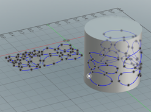

#  Fusion 360 Wrap Sketch

This script is used to wrap 2D sketch curves around a cylinder.

## Installation

See the Autodesk Fusion 360 installation steps: https://rawgit.com/AutodeskFusion360/AutodeskFusion360.github.io/master/Installation.html

## Limitations

Currently a work in progress.

The sketch curves must be contained on the XY plane.  The cylinder must be oriented with its axis aligned with the Z axis.

Only sketch splines are wrapped.  Further types will be added.

## License

Licensed under the terms of the [MIT License](http://opensource.org/licenses/MIT). Please see the [LICENSE](https://github.com/hanskellner/Fusion360WrapSketch/blob/master/LICENSE.md) file for full details.
